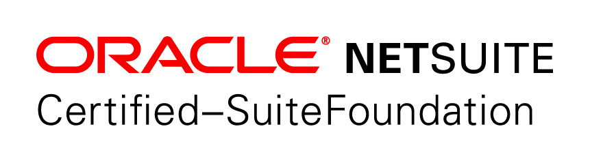
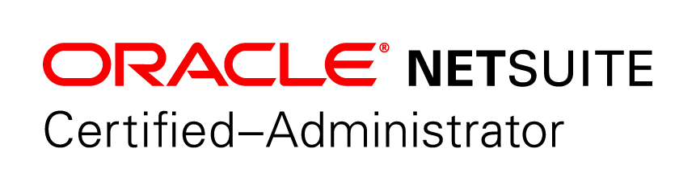

# My Info

## Me

My name is Patrick Olson and I am a NetSuite SuiteFoundation and Certified Administrator. I have been working in NetSuite as an Administrator, BA, and Project Manager for over 5 years. My primary experience is in developing business solutions in NetSuite for professional services and manufacturing organizations.

## NetSuite

I began my NetSuite career with an organization that worked in the healthcare IT space. With this organization, I was introduced to NetSuite and began my, largely, self-taught journey of learning NetSuite. This company experienced rapid growth and my team had the opportunity to implement so very interesting business solutions in NetSuite ranging from onboarding/offboarding employees to sales automation and contract management.

Over the next 5 years I was able to work often with:

- SuiteAnalytics
- SuiteBuilder
- SuiteBundler
- SuiteFlow
- OneWorld
- Enterprise Resource Planning 
- Customer Relationship Management
- Professional Services Automation

I also helped to integrated and implement the following systems with NetSuite

- Box
- Nexonia (Time & Expense)
- Concur (Travel & Expense)
- HubSpot (Marketing)
- Microsoft Azure
- Microsoft Office 365

---
My next and current employer is the manufacturing and distribution space. With this new company I have the opportunity to help mold NetSuite to the needs of a new NetSuite customer. I am learning the business processes behind this type of organization and getting the opportunity to learn and implement the following systems & modules.

- Advanced Inventory Management
- Advanced Shipping
- Advanced Receiving
- RF-Smart for inventory
- PaceJet for Shipping

## Certifications

In addition to this practical experience, I hold the following certifications
- NetSuite SuiteFoundation
- NetSuite Certified Administrator
- PMI - Project Management Professional
- Scrum Alliance - Certified Scrum Master
- ITL v3 Foundation
---

## Contact Information
I am looking forward to posting tips & tricks I have learned over the years and hope to hear from you with your feedback and suggestions. Please email [*info@mysuite.tech*](mailto:info@mysuite.tech) if you would like to reach me.

[LinkedIn Profile](https://www.linkedin.com/in/patrick-olson-pmp-csm-137a9435/)

---

<a href="https://www.linkedin.com/in/patrick-olson-pmp-csm-137a9435/" target="_blank"> </a>

