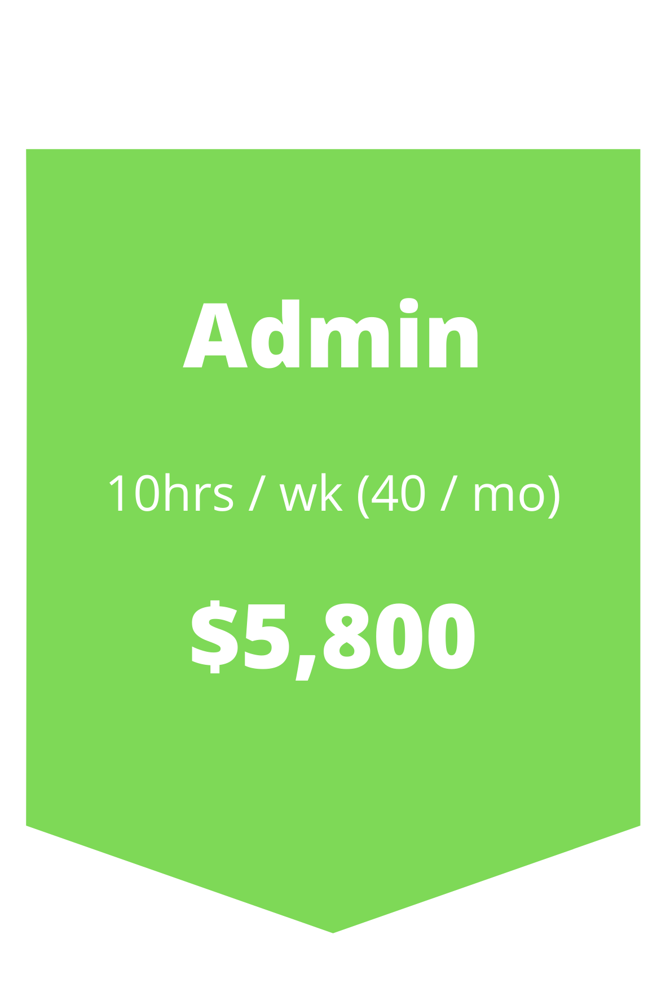
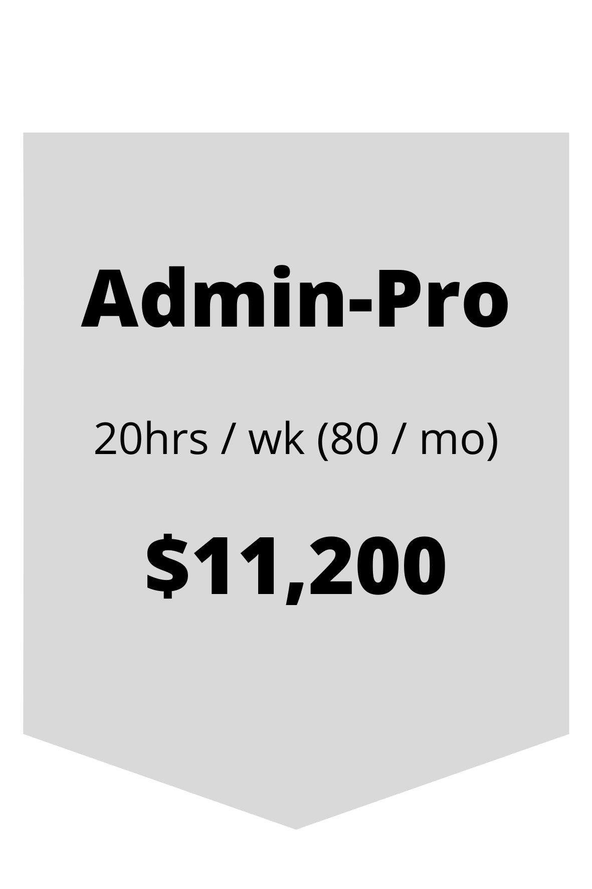

# Services

## NetSuite Services

- Configuration
- Training
- Support
- SuiteAnalytics | Reporting | Searches
- Workflows
- SuiteScript 2.0
- Enterprise Resource Planning 
- Customer Relationship Management
- Professional Services Automation
- Warehouse Management
- Pick/Pack/Ship
- Advanced Manufacturing
- Advanced Inventory Management
- Advanced Shipping
- Advanced Receiving

## Integrations

- Box
- Nexonia (Time & Expense)
- Concur (Travel & Expense)
- RF-Smart for inventory
- PaceJet for Shipping
- Celigo SmartConnectors
- Farapp
- Celigo CloudExtend

## Pricing

## Book Time

[Click here to schedule a meeting with me](/bookings/)

## Certifications

I hold the following certifications:

- NetSuite SuiteFoundation
- NetSuite Certified Administrator
- NetSuite Financial User
- NetSuite SuiteAnalytics User
- PMI - Project Management Professional
- Scrum Alliance - Certified Scrum Master
- ITL v3 Foundation
---

## Contact Form

<iframe class="clickup-embed clickup-dynamic-height" src="https://forms.clickup.com/f/a1ztg-455/O8D3D8B57R12SUCFK9" onwheel="" width="100%" height="100%" style="background: transparent; border: 0px solid #ccc;"></iframe>

[LinkedIn Profile](https://www.linkedin.com/in/patrick-olson-pmp-csm-137a9435/)

---

