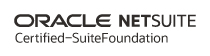
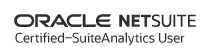

# NetSuite Certifications in 2026: What's Changed and Where to Start

[[toc]]

---

## The Program Has Changed

If you last looked at NetSuite certifications a few years ago, the program you remember is gone. What used to be a short list of exams (SuiteFoundation, Certified Administrator, a few others) has been pulled apart and rebuilt as a single tiered system, and the exams you took were renamed in the process. Oracle also changed how recertification works and moved exam delivery to a new platform.

We originally published a certification study guide in 2019. The study advice still holds up, but the program around it looks completely different now. This post covers what certs exist today, which ones matter depending on your role, and how to approach them.

---

## The Certification Landscape

Here is the change that matters, and the one the rest of this post hangs on: NetSuite did not bolt new certifications onto the old ones. It tore the whole thing down and rebuilt it as a single tiered system, then renamed the exams you already know.

If you hold a "NetSuite Certified Administrator," that exam is now **Administrator Professional**. "Certified ERP Consultant" is now **ERP Consultant Professional**. SuiteFoundation is now **SuiteFoundation Specialist**. "SuiteAnalytics User" and "Financial User" are gone as standalone names, redistributed across two new tracks. Your old certifications are still valid and you should keep listing them under the names you earned them under, but the program you would register for today does not look like the one you took.

Everything now sits in one of three tiers: **Associate**, **Specialist**, and **Professional**. Associate exams are the free entry points. Specialist exams test applied, hands-on skill. Professional exams are the deep ones, mostly the renamed versions of the old core certs. Those tiers are grouped into five role-based tracks.

**Accounting and Finance** runs from Financial Associate up through AP Specialist, AR Specialist, and FP&A Specialist, then tops out at Accounting Professional and FP&A Professional. This is where the old Financial User content went.

**BI and Reporting** runs BI & Reporting Associate, BI & Reporting Specialist, and BI & Saved Searches Professional, with a BI & Reporting Professional marked coming soon. This is where the old SuiteAnalytics User content went.

**Consultant and Administrator** is the track most working consultants care about. SuiteFoundation Specialist sits at the bottom and feeds Administrator Professional and ERP Consultant Professional. These two are the renamed Certified Administrator and Certified ERP Consultant exams, and they are still the credentials the market actually hires on.

**Developer** is Application Developer Professional and Web Services Developer Professional. There is no more SuiteCloud Developer I and II. In their place is a capstone, **SuiteCloud Developer Professional**, which you earn not by sitting one harder exam but by holding all three of SuiteFoundation, Application Developer, and Web Services Developer.

**AI** is the newest and thinnest: just AI Foundations Associate today, with Specialist and Professional levels promised.

One practitioner caveat about the tracks themselves. They are useful scaffolding for deciding what to study, but they are not rigid gates, and they are not what goes on your resume. List the exact certifications you hold. No hiring manager is filtering for "completed the BI and Reporting track." They are filtering for "Administrator Professional" or "ERP Consultant Professional." The track is a study path. The exam is the credential.

---

## Which Cert Should You Get First?

SuiteFoundation Specialist is still the real starting point for anyone planning to work in NetSuite professionally, even though the free Associate exams now technically sit below it. It is the prerequisite for Administrator, ERP Consultant, and the developer capstone, and it is the exam that proves you can actually operate the system. Six months of hands-on use is enough to start studying.

After that, the path follows your role.

**Administrators** go for Administrator Professional. It formalizes what you already do, and it expects SuiteFoundation plus about a year of real experience.

**Consultants and implementation teams** go for ERP Consultant Professional. It covers the configuration, multi-subsidiary, and platform judgment you pick up running implementations, the same ground we cover in our [implementation advisory](/blog/netsuite-implementation-resource) and [partner management](/blog/managing-your-implementation-partner) posts.

**Finance and accounting users** start with the free Financial Associate, then move to AP, AR, or FP&A Specialist depending on what you actually own day to day, with Accounting Professional or FP&A Professional as the ceiling.

**Analysts and report builders** start with the free BI & Reporting Associate, then BI & Reporting Specialist, then BI & Saved Searches Professional if advanced saved searches are central to your work.

**Developers** take SuiteFoundation, Application Developer Professional, and Web Services Developer Professional. Holding all three earns the SuiteCloud Developer Professional capstone, so there is no separate exam to chase for it.

The free Associate exams are worth the afternoon they take. They are real credentials and they feed the tracks above. But be honest about what they are: recognition, not leverage. The market still hires on SuiteFoundation, Administrator, and ERP Consultant. An Associate cert is a fine thing to have and a thin thing to lead with.

---

## Exam Logistics

A few practical details that have changed:

**Cost.** The Specialist and Professional exams run $250 each. The Associate exams are free.

**Platform.** Oracle moved exam registration and delivery to MyLearn in mid-2025. If you last registered through Webassessor, that is retired for new exams. Only the transitional recertification quiz still runs there. Start at [Oracle MyLearn](https://mylearn.oracle.com).

---

## Recertification

The old model, retake your exams every couple of years, is on its way out. What replaces it is not fully built, which makes this the one area where you should not assume anything is settled.

NetSuite is developing a new recertification program inside MyLearn. Until that lands, the bridge is the **New Release Quiz (NRQ)**: an open-book, non-proctored, 30-question quiz drawn entirely from the recent release notes, with a 70% pass mark. One pass renews all of your eligible certifications at once, currently Administrator, Application Developer, ERP Consultant, SuiteFoundation, and Web Services Developer. It costs $50 per attempt, you get three attempts, and the current cycle runs on the old Webassessor platform rather than MyLearn. The 2025 quiz closes for good on May 31, 2026, so if you are reading this around the publish date and your status is lapsing, that window is effectively now.

Treat the NRQ as the current mechanism, not the permanent one. The format, platform, and pricing of whatever MyLearn ships next are explicitly not guaranteed to match it. The one constant, across the old model and the new, is the release notes. If you read them every cycle, recertification is a formality you pass open-book in twenty minutes. If you have been ignoring them, the quiz is the system telling you to stop.

---

## Study Approach

We published study tips in the original version of this post in 2019. Most of that advice still applies, updated for 2026.

**Register first.** Pick a date and pay for it. Having a date on the calendar changes your relationship with studying. "I'll get around to it" is not a study plan.

**Use the official study guides.** The exam study guides on the Oracle certification site tell you exactly what each exam covers. They can feel overwhelming, but they are the most reliable map of what you will be tested on.

**Take practice exams seriously.** Score poorly on a practice exam, note the areas where you missed, study those areas, and take it again. You are not trying to memorize answers. You are trying to find the gaps.

**Use MyLearn training paths.** Oracle University and MyLearn now have structured learning paths aligned to each certification. These are a big step up from piecing together study materials on your own, and they did not exist in this form a few years ago.

**Use SuiteAnswers, but set a timer.** SuiteAnswers articles are dense and heavily cross-linked. Look up a specific concept, read one or two related articles, and move on. The temptation to follow every link is real and it will eat your study time.

**You do not need 100%.** You need to pass. The study guides cover a huge surface area. Learn the broad strokes of every section and go deeper on the areas that match your daily work. A few questions about obscure features are not going to be the difference.

**Schedule the exam close.** When you feel ready, move your exam date to within the next few days. Leaving it weeks out invites procrastination. Schedule it for tomorrow morning and remove the option to delay.

These badges were earned under the old exam names, which is how they should stay on your profile.

---

<ConsultingCTA message="Need a certified NetSuite admin on your team? We offer fractional administration and advisory support for organizations running NetSuite." />

**By:** [Patrick Olson](https://www.linkedin.com/in/patrick-olson-pmp/)
05/28/2026

<TagLinks />
