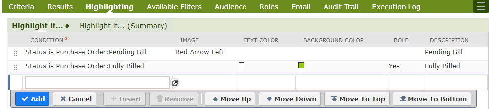
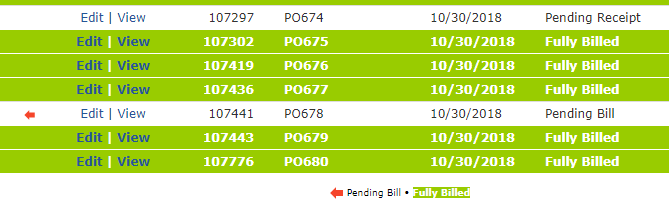
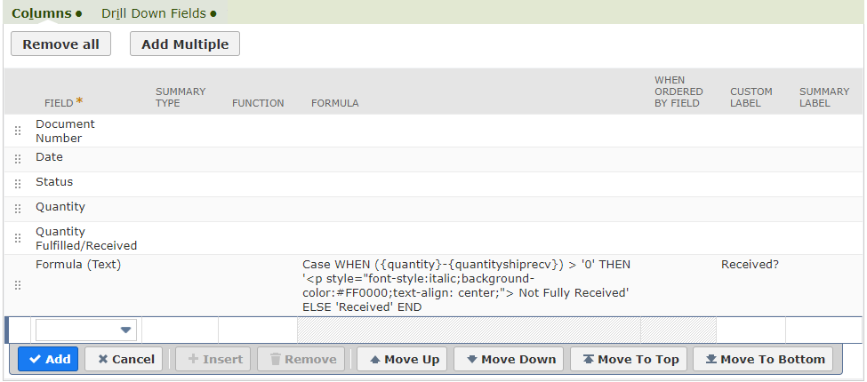
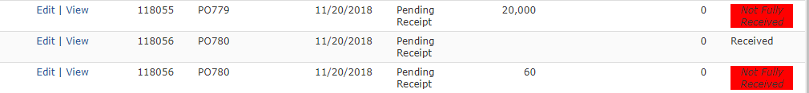
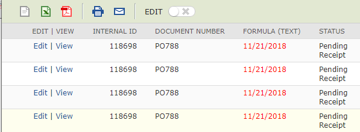

# Highlighting Saved Searches

**By:** [Patrick Olson](https://www.linkedin.com/in/patrick-olson-pmp-csm-137a9435/)

---

NetSuite has a number of useful highlighting tools for saved searches. These tools can be used to call out important data in a saved search, and generally highlight at the line level. You can highlight a lines in saved searches by condition and highlight by:
- Adding an image at the left
- Changing Text Color
- Changing Background Color
- Bolding Text

## Native Highlighting Example

In this example, I have created a Transaction Saved Search with criteria set to only show Purchase Orders

---
I have set the results to show some data about the POs

---
And the highlighting are set to add an image - "Red Arrow Left" if Status = Pending Billing and a mix of other highlights if Status = Fully Billed.

---
The output matches my highlighting criteria exactly. These highlighting features are very simple to set up and have few caveats. 

As a best practice, I try to avoid more than a couple of highlights per search, I always utilize the Description column in the highlighting section of the saved search, and I try not to use background color highlighting very often, as it can make a search hard to read.

## Highlight a single cell

But what if I want to highlight by column in a saved search? The native "Highlighting" tools in the Saved Search editor do not allow for this, but creating a simple formula can achieve this for you.

When using a field in the Results section of the Saved Search editor, you can leverage the SQL CASE WHEN formula to filter values based on criteria and then apply text or styled html elements directly into your saved search!

### Example

Using the same search from the previous example, I am going to add a Formula(text) field with a simple formula to highlight the corresponding cell if the line item on the PO is not fully received.

    Case 
    WHEN ({quantity}-{quantityshiprecv}) > '0' 
    THEN '
 Not Fully Received' 
    ELSE 'Received' 
    END

This formula has been separated into lines for readability, but will work on just one line in the Saved Search editor. The formula is saying; If the quantity ordered - the quantity received is greater than 0, then highlight, italicize and center the words "Not Fully Received"; Otherwise writer the word "Received".

In even plainer terms; If we still have items yet to be received, let me know by writing "Not Fully Received" and call that out to me by highlighting it; Otherwise simply write "Received".

In the editor tool it will look like this:

And the output:

---

This method for highlighting can get very complex. The CASE statement accepts multiple WHENs and could be used to highlight in multiple styles.

---

## Simple cell Highlighting example

A CASE statement is not necessary to highlight data in a saved search. 
Highlight a single field value can be achieved by adding the field to your formula in this format: 

    '
'||{trandate}||''  

Adding this as a formula(text) field will simply write the Date field in <text style="color:red;">red</text>

## Conclusion
---
These are a few of the different highlighting tools I use in NetSuite. There are more advanced cases of using formula fields that go beyond styling that I will cover in future posts.

Please let me know what you think of this post and if you have any questions or comments by emailing [*info@mysuite.tech*](mailto:info@mysuite.tech)
