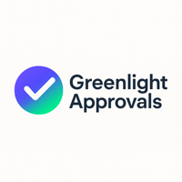

  
  

    
I'm Patrick Olson, a NetSuite Certified ERP Consultant, Certified Administrator, and PMP. I've been on both sides of implementations, building them as the consultant and protecting clients as the advisor in their corner. You get me in every session.

  

  <h3>NetSuite Health Check: $2,500</h3>
  
Find out what's quietly wrong in your account before your auditor does: access conflicts, security gaps, audit exposure, wasted license spend. A findings report ranked by risk and a fix-first roadmap, in days.

  <a href="/netsuite-health-check" class="cta-primary">Learn More</a>

I also handle <strong>implementation advisory</strong>, <strong>ongoing admin</strong>, and <strong>scoped projects</strong>. <a href="/about/">See Services →</a>

  
  
  
  
  

<h2>Field Notes</h2>

Straight talk on NetSuite implementations, controls, and getting your money's worth from your partner.

<a href="/blog/" class="cta-secondary">Read the Blog</a>

  
  

    <h3>Greenlight Approvals</h3>
    
Budget-aware, audit-ready approval automation for NetSuite.

    <a href="https://greenlightapprovals.io" target="_blank" class="cta-secondary">greenlightapprovals.io →</a>
  

