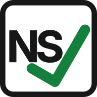

# Partners

Tools and services I trust and work with across the NetSuite ecosystem.

  

    
    <h3>Greenlight Software</h3>
    
Greenlight builds native NetSuite apps for approvals and accounts payable. We automate the routing, budget checks, and bill entry that eat your team's day, while keeping every step human-approved and audit-ready. No spreadsheets, email chains, or SuiteScript.

    <a href="https://greenlightsoftware.io" target="_blank" class="cta-secondary">greenlightsoftware.io</a>
  

  

    
    <h3>SuitePreferences</h3>
    
Chrome extension for NetSuite productivity. SuiteQL runner, Schema Explorer, SuiteConsole, dark mode, and developer tools built right into the browser.

    <a href="https://suitepreferences.com" target="_blank" class="cta-secondary">suitepreferences.com</a>
  

  
Interested in partnering? <a href="/contact/">Get in touch</a>.

